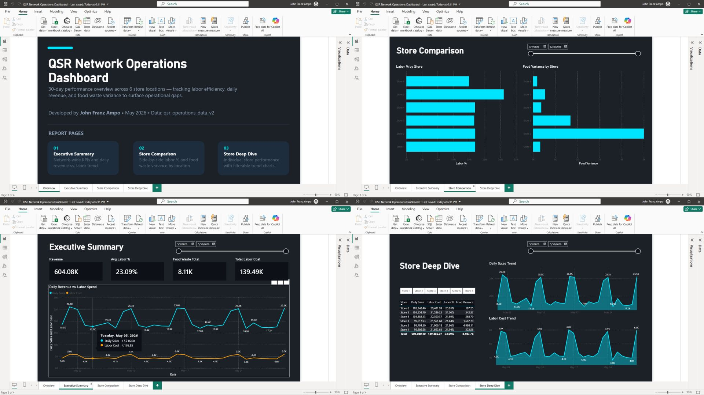
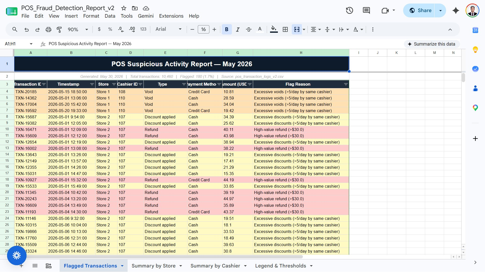

# QSR Operations & POS Fraud Detection Platform

## Overview
An end-to-end data analytics and anomaly detection solution built for a 6-store Quick Service Restaurant (QSR) franchise. This project combines Python-based data engineering with Power BI to track theoretical vs. actual food costs, optimize labor variance, and automatically isolate instances of point-of-sale (POS) fraud.

## Core Features
* **Automated Fraud Detection Pipeline:** Python (`pandas`, `openpyxl`) script that ingests thousands of raw POS logs and applies statistical thresholding to flag late-night cash theft and excessive void percentages.
* **Alert Fatigue Reduction:** Optimized detection logic to maintain a highly accurate 1.7% flag rate, eliminating false positives for standard operational refunds.
* **Executive Power BI Dashboard:** Multi-page interactive dashboard with custom DAX measures for real-time tracking of Labor % and Food Waste Variance. Drill-through capabilities allow for store-level deep dives.

## Tech Stack
* **Languages:** Python, DAX
* **Libraries:** Pandas, NumPy, OpenPyxl
* **Visualization:** Power BI
* **Data Sources:** Simulated POS transaction logs and QSR inventory feeds (10,000+ rows)

## Project Architecture
1. `generate_realistic_data.py`: Simulates 30 days of QSR transaction data, intentionally injecting fraudulent anomalies (cashier theft, late-night voids).
2. `fraud_detector_v2.py`: The ETL and analysis engine. Cleans the data, applies threshold logic, and exports a conditionally formatted `.xlsx` audit report.
3. `QSR_Network_Operations.pbix`: The business intelligence layer for operational oversight.

## Dashboard Previews

### 1. Power BI Executive Dashboard

### 2. POS Fraud Detection Audit (Excel)
